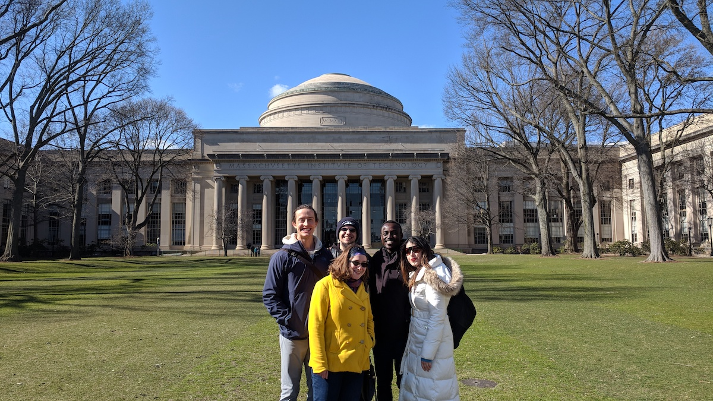

# MBTA project

## Table of Contents

- [Table of Contents](#table-of-contents)
- [APIs](#apis)
  - [MBTA](#mbta)
  - [Google](#google)
- [Application](#application)
  - [Build application using both Google Geocoding and MBTA API's](#build-application-using-both-google-geocoding-and-mbta-apis)
  - [Meetup 20180407](#meetup-20180407)
  - [Future feature ideas](#future-feature-ideas)

## APIs

### MBTA

- The Massachusetts Bay Transportation Authority (MBTA) provides a [developer portal online](https://www.mbta.com/developers).
- They have a new [MBTA V3 API](https://api-v3.mbta.com/) that provides data in JSON API format.

#### API key

- The request key button doesn't seem to be working.
- The API can be used without a key for limited purposes, so it should be okay. The [developer portal](https://www.mbta.com/developers/v3-api) says:
  > You can try it out without a key, but we strongly recommend using a key early in the development process.

### Google

We plan to feed latitude and longitude coordinates to Google Maps.

## Application

### Build application using both Google Geocoding and MBTA API's

Abdou's ideas for application features

1. Rank schools based on the density of MBTA Bus stops
    - Generate a list of universities in the Boston/Cambridge/Somerville areas
    - Obtain geolocation information of these universities
    - Get MBTA stops and their geolocation data
    - Write an algorithm to get the distance between 2 geolocation points
    - Use said algorithm to grab MBTA stops that are within 1 mile from a given university
    - Use the number from previous step as a grade for the given university
    - Iterate previous steps for every university

2. Are MBTA stops near hospitals/clinic/healthcare centers equipped with wheelchair boarding?
    - Generate a list of hospitals in the Boston/Cambridge/Somerville areas
    - Obtain geolocation information of these hospitals
    - Get MBTA stops with wheelchair boarding and their geolocation data
    - Write an algorithm to get the distance between 2 geolocation points
    - Rank hospitals by their "level of access" of MBTA stops with wheelchair boarding

I have written some code to get a decent list of universities in the metropolitan area of Boston. It's in `python` and located in [get_university_list.py](get_university_list.py):

```python
#!/usr/bin/env python3

import re

import pandas as pd


def get_list(url):
  """
  Grab the list of university located at the given URL.
  We're cheating here because we know that the link is a
  wikipedia page with a table that contains the data.
  So, we're using pandas to grab the contents of the table
  and turn them into a json file.

  :type: str
  :param: url: URL to the Wikipedia article with the list of universities
  :rtype: str
  :return: Returns a json string
  """
  universities = pd.read_html(url, header=0)[0]
  universities.columns = list(map(lambda col: re.sub(r'\[[^\]]\]', '', col).lower(), universities))
  clean_data = universities.drop(columns=[c for c in universities if c.startswith('unnamed')])
  return clean_data.to_json(orient='records')


if __name__ == '__main__':
  article_url = "https://en.wikipedia.org/wiki/List_of_colleges_and_universities_in_metropolitan_Boston"
  print(get_list(article_url), file=open("universities.json", "w"))
```

This should generate a `JSON` file with the names of the universities and some additional attributes.

The following piece of code is to retrieve the geolocation information a given university name. It's in `JavaScript`. You won't be able to run it without creating a Google Maps API Key and adding said key to your machine as an environment variable. In any case, here it is:

```javascript
// This is supposed to script to define a Place class/prototype

let https = require('https');

const token = process.env.GMAPS_API;

class Place {
  constructor({name = null, street = null, placeID = null, lat = null, long = null} = {}) {
    this.name = name;
    this.street = street;
    this.placeID = placeID;
    this.lat = lat;
    this.long = long;
  }

  getStreet() {
    return this.street;
  }

  getLat() {
    return this.lat;
    }

  getLong() {
    return this.long;
    }

  getPlaceID() {
    return this.placeID;
    }

    setStreet(val) {
    this.street = val;
    }

  setLat(val) {
    this.lat = val;
    }

  setLong(val) {
    this.long = val;
    }

  setPlaceID(val) {
    this.placeID = val;
    }

  populateAttributes() {
    const url = `https://maps.googleapis.com/maps/api/geocode/json?address=${this.name.replace(' ', '+')}&key=${token}`;
    https.get(url, response => {
      let body = "";
      response.on("data", data => {
        body += data;
      });
      response.on("end", () => {
        body = JSON.parse(body);
        this.setStreet(body.results[0].formatted_address);
        this.setPlaceID(body.results[0].place_id);
        this.setLat(body.results[0].geometry.location.lat);
        this.setLong(body.results[0].geometry.location.lng);
        // console.log(this);
      });
    }).on("error", (e) => {
      console.error(e);
    });
    // console.log(this);
    }

  // Get the MBTA bus stops within a 1 mile radius
  getStops() {
    // Point this call to an API with lat=this.lat&long=this.long&radius=1
    }

  toString() {
    return `Name: ${this.name}\nStreet Address: ${this.street}\nLatitute: ${this.lat} N\nLongitude: ${this.long} W.`;
  }
}

let mit = new Place({
  name: 'Massachusetts Institute of Technology',
  street: '77 Massachusetts Avenue, Cambridge, MA 02139',
  lat: 42.36,
  long: -71.092
});

mit.populateAttributes();
setTimeout(function() {
  console.log(mit);
}, 1000);
console.log(mit);
```

We can discuss all these things tomorrow.

### Meetup 20180407

#### Details

- We met up at MIT. Abdou had booked Building 38, room 166, but there was a classroom of kids there doing math. We moved to Building 1 room 134, then up to Abdou's office in Building 11 room 268.
- Brendon proposed the basic front-end design of the app.
  - Import Bootstrap for styling
  - Navbar at top
  - Large center container with map and search field
  - Map pins with popups that read JSON data to return number of stops nearby, with and without wheelchair accessibility.
  - He based the design on the Neighborhood Map project he is about to do for the Udacity Full Stack Web Developer Nanodegree program. Konrad Schieban has completed the program, and [his project](https://konradschieban.github.io/) was a helpful starting point for us.
  - Brendon DM'ed Konrad on Slack with info on the project.
- Abdou wrote some Python and JavaScript code ahead of time, and suggested ways that we could use JSON data for our app.
- Brendon and Abdou agreed on code formatting guidelines.
- Jennifer is planning to do some design work in Adobe Creative Suite, to provide graphics for the app. She will also work on the front-end.
- Serene shared some JavaScript for interfacing with the Google Maps API.
- Josh and Becca also came by and contributed.
- We're hoping to make some more progress in the next few days. Abdou and Josh will work on the map coordinates, Jennifer will work on design, and Brendon will provide input on all aspects as "Benevolent Dictator."

#### Slack message



Remember how I said we should start a project? Well we did! The #massachusetts crew had a great meetup again today at MIT. We’re working on a **web app that integrates Google Maps and MBTA** (public transportation) data.

Contributors:

- @AbdouSeck
  - **Chief Data Wrangler**
  - **Friendly DevOps**
  - **Location Services**
- @br3ndonland
  - **Nominated Benevolent Dictator**
  - **Dr. Documentation**
  - **Master of Markdown**
- @jethridge13
  - **Cartesian Contributor**
  - **Interstate Transportation Logistics**
- @noirfatale
  - **Design Maven**
  - **People Ops**
- @sereneliu
  - **Front-End Ninja**

We’re just working out the beginnings on a dev branch right now, but **star the [repo](https://github.com/growwithgooglema/gwg-mbta)!** Feel free to submit suggestions in the future with pull requests or issues on GitHub! And as always, Stay Udacious!

---

### Future feature ideas

#### @br3ndonland

- We could use one of the [JavaScript client libraries](http://jsonapi.org/implementations/#client-libraries-javascript) that reads JSON API data.
- It would be cool to **display a map with real-time locations** of the buses.
- We could also **color the roads** like Google Maps does to show traffic, but just for MBTA vehicles.